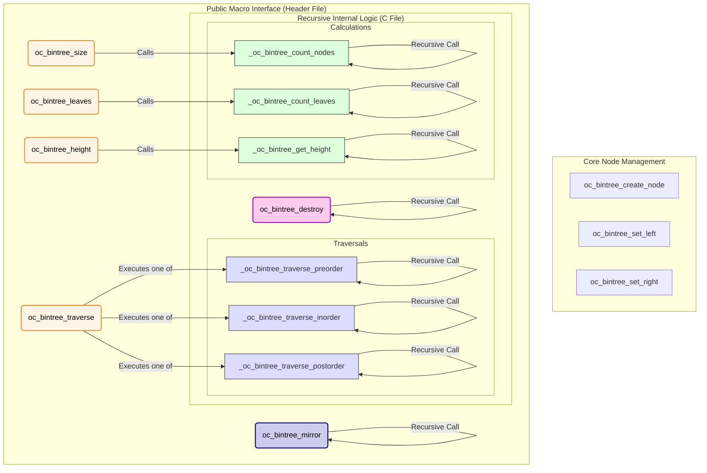

```mermaid
graph TD
    subgraph "Core Node Management"
        A[oc_bintree_create_node]
        C[oc_bintree_set_left]
        D[oc_bintree_set_right]
    end

    subgraph "Public Macro Interface (Header File)"
        M1(oc_bintree_traverse)
        M2(oc_bintree_size)
        M3(oc_bintree_leaves)
        M4(oc_bintree_height)
        E(oc_bintree_mirror)

        subgraph "Recursive Internal Logic (C File)"
            direction LR
            B(oc_bintree_destroy)

            subgraph "Traversals"
                F[_oc_bintree_traverse_preorder]
                G[_oc_bintree_traverse_inorder]
                H[_oc_bintree_traverse_postorder]
            end

            subgraph "Calculations"
                I[_oc_bintree_count_nodes]
                J[_oc_bintree_count_leaves]
                K[_oc_bintree_get_height]
            end
        end
    end

    %% Macro -> Internal Function Calls
    M1 -->|Executes one of| F & G & H
    M2 -->|Calls| I
    M3 -->|Calls| J
    M4 -->|Calls| K

    %% Recursive Nature (Self-Calls)
    B -- "Recursive Call" --> B
    E -- "Recursive Call" --> E
    F -- "Recursive Call" --> F
    G -- "Recursive Call" --> G
    H -- "Recursive Call" --> H
    I -- "Recursive Call" --> I
    J -- "Recursive Call" --> J
    K -- "Recursive Call" --> K

    %% Style the recursive/internal functions
    style B fill:#fce, stroke:#a0c, stroke-width:2px, color:#000
    style E fill:#cce, stroke:#006, stroke-width:2px, color:#000
    style F fill:#ddf, stroke:#333
    style G fill:#ddf, stroke:#333
    style H fill:#ddf, stroke:#333
    style I fill:#dfd, stroke:#333
    style J fill:#dfd, stroke:#333
    style K fill:#dfd, stroke:#333

    style M1 fill:#fff5e6, stroke:#e69138, stroke-width:2px, color:#000
    style M2 fill:#fff5e6, stroke:#e69138, stroke-width:2px, color:#000
    style M3 fill:#fff5e6, stroke:#e69138, stroke-width:2px, color:#000
    style M4 fill:#fff5e6, stroke:#e69138, stroke-width:2px, color:#000
```
