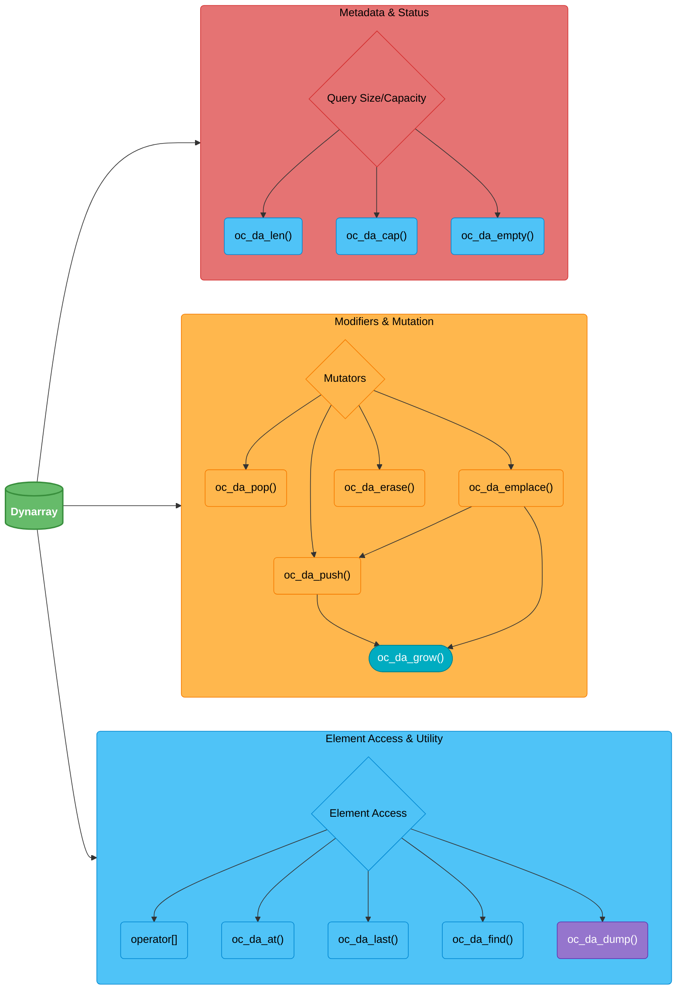

# Graphical Illustration for Dynarray

```mermaid
%%{init: {'flowchart': {'htmlLabels': false}}}%%
flowchart LR

%% 1. STYLES DEFINITION
    classDef mainNode fill:#66BB6A,stroke:#388E3C,stroke-width:2px,color:#FFFFFF,rx:8px,ry:8px,font-weight:bold
    classDef metadata fill:#E57373,stroke:#D32F2F,color:#000,rx:5px,ry:5px
    classDef access fill:#4FC3F7,stroke:#0288D1,color:#000,rx:5px,ry:5px
    classDef modifier fill:#FFB74D,stroke:#F57C00,color:#000,rx:5px,ry:5px
    classDef utility fill:#9575CD,stroke:#5E35B1,color:#FFFFFF
    classDef action fill:#00ACC1,stroke:#00838F,color:#FFFFFF

%% 2. MAIN NODE
    A[(Dynarray)]:::mainNode

%% 3. SUBGRAPHS FOR LOGICAL GROUPING
    subgraph S_META [Metadata & Status]
        B0{Query Size/Capacity}:::metadata
        C_LEN("oc_da_len()"):::access
        C_CAP("oc_da_cap()"):::access
        C_EMPTY("oc_da_empty()"):::access
        B0 --> C_LEN & C_CAP & C_EMPTY
    end

    subgraph S_MOD [Modifiers & Mutation]
        B1{Mutators}:::modifier
        C_PUSH("oc_da_push()"):::modifier
        C_POP("oc_da_pop()"):::modifier
        C_EMPLACE("oc_da_emplace()"):::modifier
        C_ERASE("oc_da_erase()"):::modifier
        D_GROW(["oc_da_grow()"]):::action

        B1 --> C_PUSH & C_POP & C_EMPLACE & C_ERASE
        
        C_PUSH --> D_GROW
        C_EMPLACE --> C_PUSH
        C_EMPLACE --> D_GROW
    end

    subgraph S_ACCESS [Element Access & Utility]
        B2{Element Access}:::access
        C_OP_BRACKET("operator[]"):::access
        C_AT("oc_da_at()"):::access
        C_LAST("oc_da_last()"):::access
        C_FIND("oc_da_find()"):::access
        C_DUMP("oc_da_dump()"):::utility

        B2 --> C_OP_BRACKET & C_AT & C_LAST & C_FIND & C_DUMP
    end

%% 4. CONNECTIONS TO MAIN NODE
    A --> S_META
    A --> S_MOD
    A --> S_ACCESS

%% 5. OPTIONAL: Apply classes to nodes/subgraphs
    class A mainNode
    class S_META metadata
    class S_MOD modifier
    class S_ACCESS access
```
