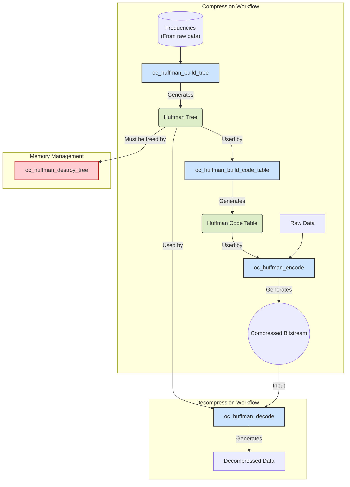

```mermaid
flowchart TD
    subgraph "Compression Workflow"
        direction LR
        A_Freqs[("Frequencies\n(From raw data)")] --> B_BuildTree[oc_huffman_build_tree]
        B_BuildTree -- Generates --> C_Tree(Huffman Tree)
        C_Tree -- Used by --> D_BuildTable[oc_huffman_build_code_table]
        D_BuildTable -- Generates --> E_Table(Huffman Code Table)
        E_Table -- Used by --> F_Encode[oc_huffman_encode]
        A_RawData[Raw Data] --> F_Encode
        F_Encode -- Generates --> G_Compressed((Compressed Bitstream))
    end

    subgraph "Decompression Workflow"
        direction LR
        C_Tree -- Used by --> H_Decode[oc_huffman_decode]
        G_Compressed -- Input --> H_Decode
        H_Decode -- Generates --> I_Decompressed[Decompressed Data]
    end

    subgraph "Memory Management"
        C_Tree -- Must be freed by --> J_Destroy[oc_huffman_destroy_tree]
    end

    %% Styling
    style B_BuildTree fill:#cde4ff,stroke:#333,stroke-width:2px
    style D_BuildTable fill:#cde4ff,stroke:#333,stroke-width:2px
    style F_Encode fill:#cde4ff,stroke:#333,stroke-width:2px
    style H_Decode fill:#cde4ff,stroke:#333,stroke-width:2px
    style J_Destroy fill:#ffcdd2,stroke:#b71c1c,stroke-width:2px

    style C_Tree fill:#dcedc8,stroke:#333
    style E_Table fill:#dcedc8,stroke:#333
```
