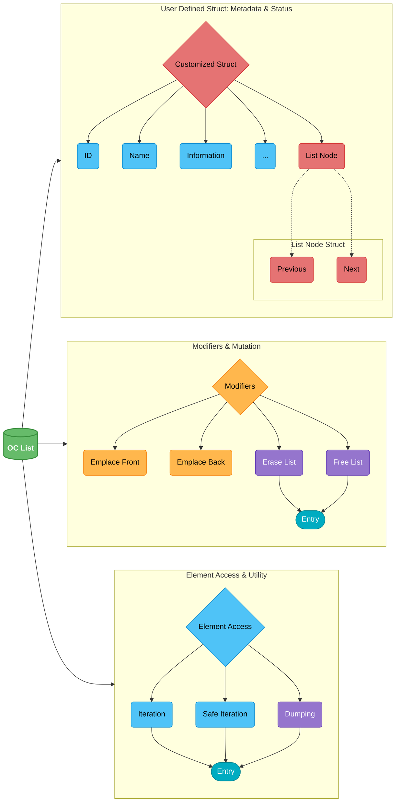

# Graphical Illustration for List

```mermaid
%%{init: {'flowchart': {'htmlLabels': false}}}%%
flowchart LR

%% STYLES DEFINITION
  classDef mainNode fill:#66BB6A,stroke:#388E3C,stroke-width:2px,color:#FFFFFF,rx:8px,ry:8px,font-weight:bold
  classDef metadata fill:#E57373,stroke:#D32F2F,color:#000,rx:5px,ry:5px
  classDef access fill:#4FC3F7,stroke:#0288D1,color:#000,rx:5px,ry:5px
  classDef modifier fill:#FFB74D,stroke:#F57C00,color:#000,rx:5px,ry:5px
  classDef utility fill:#9575CD,stroke:#5E35B1,color:#FFFFFF
  classDef action fill:#00ACC1,stroke:#00838F,color:#FFFFFF

%% MAIN NODE
  A[(OC List)]:::mainNode

%% SUBGRAPHS FOR LOGICAL GROUPING
  subgraph S_META [User Defined Struct: Metadata & Status]
    B0{Customized Struct}:::metadata
    C_ID("ID"):::access
    C_NAME("Name"):::access
    C_INFO("Information"):::access
    C_ETC("..."):::access
    C_LIST_NODE("List Node"):::metadata
    B0 --> C_ID & C_NAME & C_INFO & C_ETC & C_LIST_NODE

    subgraph S_NODE[List Node Struct]
      direction TB
      SN_P("Previous"):::metadata;
      SN_N("Next"):::metadata;
    end

    C_LIST_NODE -..-> SN_P;
    C_LIST_NODE -..-> SN_N;
  end

  subgraph S_MOD [Modifiers & Mutation]
    B1{Modifiers}:::modifier
    C_FRONT("Emplace Front"):::modifier
    C_BACK("Emplace Back"):::modifier
    C_ERASE("Erase List"):::utility
    C_FREE("Free List"):::utility
    C_ENTRY(["Entry"]):::action

    B1 --> C_FRONT & C_BACK & C_ERASE & C_FREE

    C_ERASE --> C_ENTRY
    C_FREE --> C_ENTRY
  end

  subgraph S_ACCESS [Element Access & Utility]
    B2{Element Access}:::access
    C_ITER("Iteration"):::access
    C_SAFE_ITER("Safe Iteration"):::access
    C_DUMP("Dumping"):::utility

    C_ENTRY_(["Entry"]):::action

    B2 --> C_ITER & C_SAFE_ITER & C_DUMP
    C_ITER --> C_ENTRY_
    C_SAFE_ITER --> C_ENTRY_
    C_DUMP --> C_ENTRY_
  end

%% CONNECTIONS TO MAIN NODE
  A --> S_META
  A --> S_MOD
  A --> S_ACCESS
```
