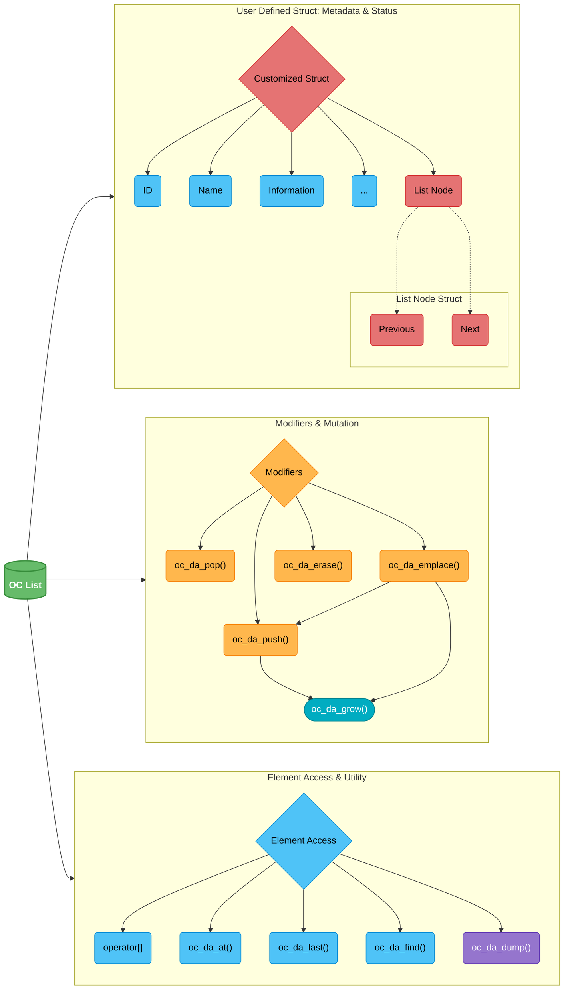

# Graphical Illustration for List

```mermaid
%%{init: {'flowchart': {'htmlLabels': false}}}%%
flowchart LR

%% 1. STYLES DEFINITION
  classDef mainNode fill:#66BB6A,stroke:#388E3C,stroke-width:2px,color:#FFFFFF,rx:8px,ry:8px,font-weight:bold
  classDef metadata fill:#E57373,stroke:#D32F2F,color:#000,rx:5px,ry:5px
  classDef access fill:#4FC3F7,stroke:#0288D1,color:#000,rx:5px,ry:5px
  classDef modifier fill:#FFB74D,stroke:#F57C00,color:#000,rx:5px,ry:5px
  classDef utility fill:#9575CD,stroke:#5E35B1,color:#FFFFFF
  classDef action fill:#00ACC1,stroke:#00838F,color:#FFFFFF

%% 2. MAIN NODE
  A[(OC List)]:::mainNode

%% 3. SUBGRAPHS FOR LOGICAL GROUPING
  subgraph S_META [User Defined Struct: Metadata & Status]
    B0{Customized Struct}:::metadata
    C_ID("ID"):::access
    C_NAME("Name"):::access
    C_INFO("Information"):::access
    C_ETC("..."):::access
    C_LIST_NODE("List Node"):::metadata
    B0 --> C_ID & C_NAME & C_INFO & C_ETC & C_LIST_NODE

    subgraph S_NODE[List Node Struct]
      direction TB
      SN_P("Previous"):::metadata;
      SN_N("Next"):::metadata;
    end

    C_LIST_NODE -..-> SN_P;
    C_LIST_NODE -..-> SN_N;
  end

  subgraph S_MOD [Modifiers & Mutation]
    B1{Modifiers}:::modifier
    C_PUSH("oc_da_push()"):::modifier
    C_POP("oc_da_pop()"):::modifier
    C_EMPLACE("oc_da_emplace()"):::modifier
    C_ERASE("oc_da_erase()"):::modifier
    D_GROW(["oc_da_grow()"]):::action

    B1 --> C_PUSH & C_POP & C_EMPLACE & C_ERASE
    
    C_PUSH --> D_GROW
    C_EMPLACE --> C_PUSH
    C_EMPLACE --> D_GROW
  end

  subgraph S_ACCESS [Element Access & Utility]
    B2{Element Access}:::access
    C_OP_BRACKET("operator[]"):::access
    C_AT("oc_da_at()"):::access
    C_LAST("oc_da_last()"):::access
    C_FIND("oc_da_find()"):::access
    C_DUMP("oc_da_dump()"):::utility

    B2 --> C_OP_BRACKET & C_AT & C_LAST & C_FIND & C_DUMP
  end

%% 4. CONNECTIONS TO MAIN NODE
  A --> S_META
  A --> S_MOD
  A --> S_ACCESS
```
